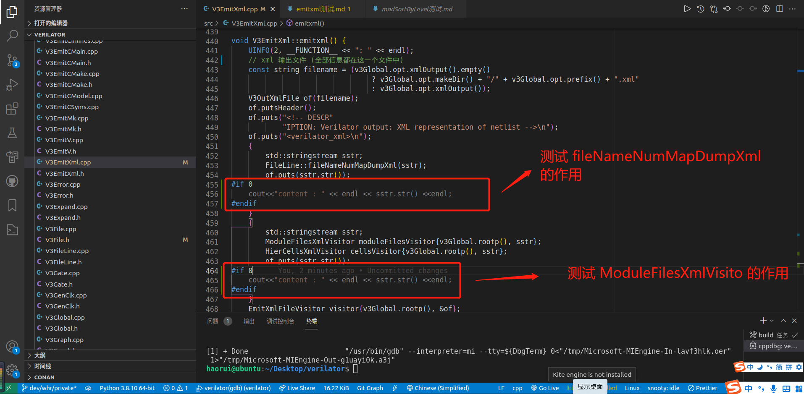

# emitxml测试

## 测试文件

- LibBlackbox.v
- s27_net_modified.v

## 测试输出

- Vs27_net_modified.xml

> 在 note 目录下的 misc 中可以找到

## 测试目的

判断 xml 文件中有效信息究竟是在哪里产生的。

## 测试锚点

在 V3EmitXml::emitxml() 添加以下标准输出：



## 锚点输出

### 第一个输出

```txt
<files>
<file id="d" filename="/home/haorui/Desktop/verilator/note/misc/LibBlackbox.v" language="1800-2017"/>
<file id="c" filename="/home/haorui/Desktop/verilator/note/misc/s27_net_modified.v" language="1800-2017"/>
<file id="a" filename="&lt;built-in&gt;" language="1800-2017"/>
<file id="b" filename="&lt;command-line&gt;" language="1800-2017"/>
</files>
```

### 第二个输出

```txt
<module_files>
<file id="c" filename="/home/haorui/Desktop/verilator/note/misc/s27_net_modified.v" language="1800-2017"/>
<file id="d" filename="/home/haorui/Desktop/verilator/note/misc/LibBlackbox.v" language="1800-2017"/>
</module_files>
<cells>
<cell fl="c8" loc="c,8,8,8,11" name="s27" submodname="s27" hier="s27">
<cell fl="c13" loc="c,13,11,13,25" name="DFF_0_I1_Q_reg" submodname="DFFHQX1" hier="s27.DFF_0_I1_Q_reg"/>
<cell fl="c14" loc="c,14,11,14,25" name="DFF_1_I1_Q_reg" submodname="DFFHQX1" hier="s27.DFF_1_I1_Q_reg"/>
<cell fl="c15" loc="c,15,11,15,25" name="DFF_2_I1_Q_reg" submodname="DFFHQX1" hier="s27.DFF_2_I1_Q_reg"/>
<cell fl="c17" loc="c,17,11,17,25" name="DFF_3_I1_Q_reg" submodname="DFFHQX1" hier="s27.DFF_3_I1_Q_reg"/>
<cell fl="c27" loc="c,27,9,27,17" name="NOT_0_U1" submodname="INVX1" hier="s27.NOT_0_U1"/>
<cell fl="c28" loc="c,28,9,28,17" name="NOT_1_U1" submodname="INVX1" hier="s27.NOT_1_U1"/>
<cell fl="c29" loc="c,29,10,29,19" name="AND2_0_U1" submodname="AND2X1" hier="s27.AND2_0_U1"/>
<cell fl="c30" loc="c,30,9,30,17" name="OR2_0_U1" submodname="OR2X1" hier="s27.OR2_0_U1"/>
<cell fl="c31" loc="c,31,9,31,17" name="OR2_1_U1" submodname="OR2X1" hier="s27.OR2_1_U1"/>
<cell fl="c32" loc="c,32,11,32,21" name="NAND2_0_U1" submodname="NAND2X1" hier="s27.NAND2_0_U1"/>
<cell fl="c33" loc="c,33,10,33,19" name="NOR2_0_U1" submodname="NOR2X1" hier="s27.NOR2_0_U1"/>
<cell fl="c34" loc="c,34,10,34,19" name="NOR2_1_U1" submodname="NOR2X1" hier="s27.NOR2_1_U1"/>
<cell fl="c35" loc="c,35,10,35,19" name="NOR2_2_U1" submodname="NOR2X1" hier="s27.NOR2_2_U1"/>
<cell fl="c36" loc="c,36,10,36,19" name="NOR2_3_U1" submodname="NOR2X1" hier="s27.NOR2_3_U1"/>
</cell>
</cells>
```

## 测试结论

在这两个标准输出中，均为见到 `<netlist> </netlist>` ，由此分析到之前这两个东西应该不用太过关心其实现，大概浏览即可，
而应该把中心放在 EmitXmlFileVisitor 上，剖析其实现，对着模仿一个 Vistor 即可实现自己想要的功能。

> `<netlist> </netlist>` 涵盖着我们需要的东西。
>
> 不应该修改 V3EnitXml.cpp ，而应该看其实现，自己仿写一个，注意 LGPL 协议。
