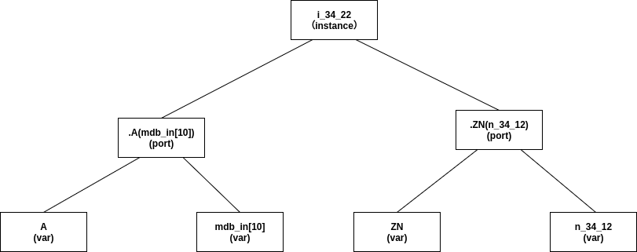

# verilator 抽象语法树

## 抽象语法树概念

抽象语法树 (abstract syntax code, AST) 是一种以树型数据结构来表示文本源代码的代码表达方式；AST 的树型
结构并非特指数据结构，而泛指一切具有树行为方式；也就是抽象语法树的实现可以不使用树的数据结构，而只需要在行为
上体现处类似于树的特征即可。

例如对下列的 HDL 语句:

```verilog
INV_X1_LVT i_34_22 (.A(mdb_in[10]),.ZN(n_34_12));
```

上述HDL语句的语法树表示方式如下:


抽象语法树不同于普通的树型结构在于大多数的树型结构只有叶子节点是具有具体含义的，而抽象语法树除了叶子节点之外，
每一个节点都有其具体的含义；这也是抽象语法树中抽象的来源，如图中 .A(mdb_in[10]) 与 A 和 mdb_in[10] ，
.A(mdb_in[10]) 表示的是一种抽象的端口概念，而 A 和 mdb_in[10] 则代表的实际出端口以及入端口，是 .A(mdb_in[10])
实现的具体细节。

## verilator 的抽象语法树实现

verilator 实现抽象语法树的形式与很多编译器实现的方式并不相同，verilator 的抽象语法树的实现是基于一棵庞大的继承树，
其之所以能够以继承树实现AST的主要原因是运用了C++的继承与多态特性。

verilator 的抽象语法书亦继承树的结果如下(展示部分，过于庞大):


verilator 的抽象语法树的究极抽象形式就是 AstNode；若面向对象中万物皆对象，linux中万物皆文件，那么对于 verilator 而言 verilog 中的每一个节点均可以使用 AstNode 来表示；这也是在上图中 AstNode 是所有子类的公共基类。

AstNode 是一个非常抽象的基类，它的衍生类既可以是一个组件类，例如 AstNodeMath ，其涵盖了所有的运算符操作，也可以是派生出一个功能类例如 AstCell，其起着描述 verilog 中 module 关键字的职责；在 verilator 中，语法树创建时使用具体的类名，例如实例一个 module 将会创建一个 AstCell，而实际存储为 AstNode , 通过重载 AstNVisitor 中的 visit 方法即可实现访问 AstNode 衍生类功能；通过 c++
的多态技术，我们可以使用统一个容器来存储抽象语法树的各个节点，而不需要其具体的含义，而在我们遍历这些都为 AstNode 的节点时却可以知道它们具体的含义。
