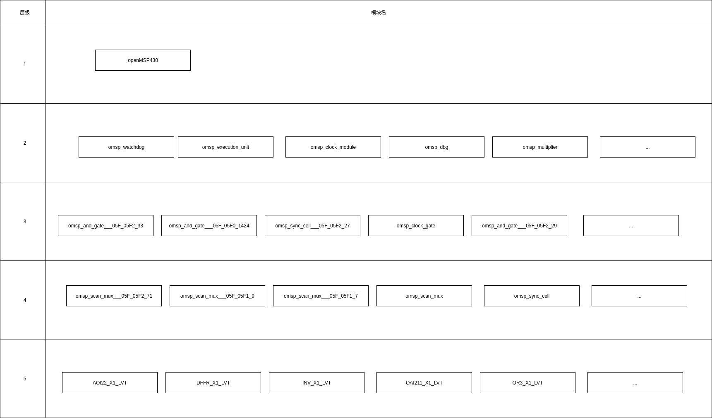
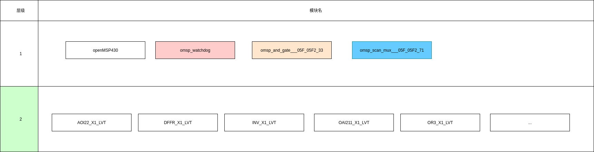

# 层次化网表像平面化网表的转化过程

## 层次化网表的层级

在层次化网表中，网表之间是具有层级关系的，如下图:



可以看见层次为1的模块有且仅有一个，即为顶级模块 openMSP430; 而其余模块的层次正是从 openMSP430 开始
进行推算的，若将上图中模块与模块之间的相互调用关系用图画出来的，各个模块的层次即为从图中位置到 openMSP430
的最长距离；值得一提的是，图中是不可能出现回环的，否则将出现无限递归的情况。

同时也可以看到在最底层的模块里，所有的模块都为基本模块，即模块存在不可分解的特性，例如 INV_X1_LVT、
OR3_X1_LVT 等等。

## 层次化网表展开理论依据

在上图中，openMSP430之所以是一张层次化网表，最主要的原因就是因为在该网表中嵌套了不是基本模块的子模块，即
依赖图中 2~4 层的模块实现其功能；而网表扁平化的具体操作就是使openMSP430直接依赖基本模块，不依赖其余非
基本模块的子模块，即将子模块展开全部有基本模块组成，若将上图中的层次化网表完全展开，则会得到下图:



在完全展开的平面化网表中，网表的层级有且仅有两层，并且层级为1的模块为非基本模块，而层级为2的模块均为基本模块；
层次化网表向平面化网表的核心步骤就是不断降低每个模块的层级，直到除了基本模块外的所有模块的层级均为1为止；

从图论的角度来看待这个问题，就是要减低各子模块到顶层模块中的最长距离，以层次化网表用例图为例，若
omsp_scan_mux___05F_05F2_71 有且仅被 omsp_and_gate___05F_05F2_33 所包含，那么仅仅只需要将
omsp_and_gate___05F_05F2_33 中的  omsp_scan_mux___05F_05F2_71 实例用基本模块替代，那么
omsp_scan_mux___05F_05F2_71 的层次就可以成功地从层次4向层次3进行推移。

从代码的角度来看待这个问题，每个模块均可以看做成一个函数，或者更加特别一点，看做一个内联inline函数，只要逐层
地将内联函数展开，那么顶层模块亦可以变成仅仅由基础模块组成；值得一提的是，内联展开的顺序遵循栈解旋的方向，即
这个动作将会从层次数高的模块开始，向层次数低的模块进行，并且每个模块有且仅被遍历一次。

## 层次化网表展开案例

若存在子模块定义如下:

```verilog
module omsp_scan_mux___05F_05F1_7(data_out,data_in_scan,data_in_func,scan_mode);
    output data_out;
    input data_in_scan;
    input data_in_func;
    input scan_mode;

    wire n_0_0;
    wire n_0_1;

    INV_X1_LVT i_0_0 (.A(scan_mode),.ZN(n_0_0));
    AOI22_X1_LVT i_0_1 (.A1(n_0_0),.A2(data_in_func),.B1(data_in_scan),.B2(scan_mode),.ZN(n_0_1));
    INV_X1_LVT i_0_2 (.A(n_0_1),.ZN(data_out));
endmodule
```

其在父模块实例对象如下:

```verilog
module omsp_wakeup_cell___05F_05F0_1428(wkup_out,scan_clk,scan_mode,scan_rst,wkup_clear,wkup_event);
    // ...
    omsp_scan_mux___05F_05F1_7 scan_mux_rst (.data_out(wkup_rst),.data_in_scan(scan_rst),.data_in_func(wkup_clear),.scan_mode(scan_mode));
    // ...
endmodule
```

则将其在父模块中展开可以得到以下结果:

```verilog
module omsp_wakeup_cell___05F_05F0_1428(wkup_out,scan_clk,scan_mode,scan_rst,wkup_clear,wkup_event);
    // ...
    wire scan_mux_rst_n_0_0;
    wire scan_mux_rst_n_0_1;

    INV_X1_LVT scan_mux_rst_i_0_0 (.A(scan_mode),.ZN(scan_mux_rst_n_0_0));
    AOI22_X1_LVT scan_mux_rst_i_0_1 (.A1(scan_mux_rst_n_0_0),.A2(wkup_clear),.B1(scan_rst),.B2(scan_mode),.ZN(scan_mux_rst_n_0_1));
    INV_X1_LVT scan_mux_rst_i_0_2 (.A(scan_mux_rst_n_0_1),.ZN(wkup_rst));
    // ...
endmodule
```

稍加分析可以发现子模块中的 input 和 output 引脚均被父模块的引脚所替换，因为它们之间的关系本身就是引脚直连，而对于展开的基本模块实例以及 wire 类型，则将其从
子模块中反向注入到父模块中，为了防止同名冲突，均加上子模块实例名称作为其前缀；只要重复进行上诉这个操作，最终就可以得到一个仅有基本模块构成的顶级模块。
