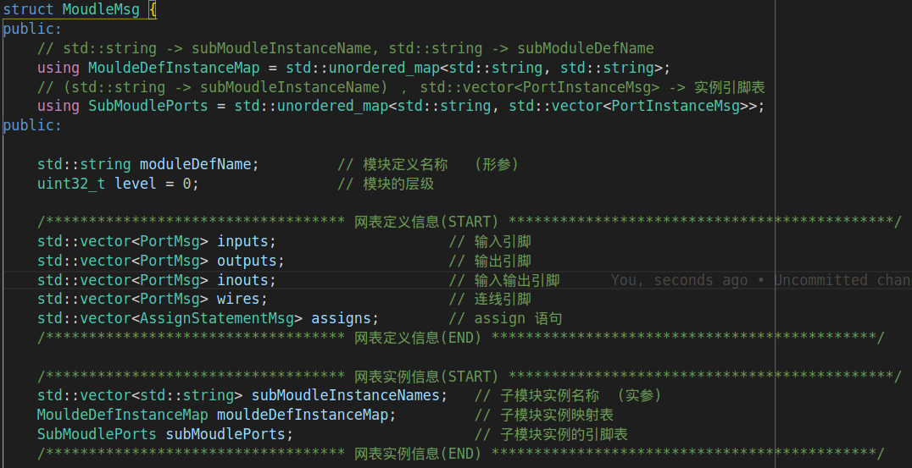

# 层次化网表数据结构设计

层次化网表的设计原则如下:

- 能够完整地描述整个网表
- 尽可能使用较小的系统资源 (内存)
- 尽可能提升遍历网表速度

下面为一个完整的 RTL 级别的 verilog 模块:

```verilog
module omsp_wakeup_cell___05F0_1428(wkup_out,scan_clk,scan_mode,scan_rst,wkup_clear,wkup_event);
    output wkup_out;
    input scan_clk;
    input scan_mode;
    input scan_rst;
    input wkup_clear;
    input wkup_event;

    wire wkup_rst;
    wire wkup_clk;
    wire n_0;


    omsp_scan_mux___05F1_9 scan_mux_clk (.data_out(wkup_clk),.data_in_scan(scan_clk),.data_in_func(wkup_event),.scan_mode(scan_mode));
    omsp_scan_mux___05F1_7 scan_mux_rst (.data_out(wkup_rst),.data_in_scan(scan_rst),.data_in_func(wkup_clear),.scan_mode(scan_mode));
    INV_X1_LVT i_0_0 (.A(wkup_rst),.ZN(n_0));
    DFFR_X1_LVT wkup_out_reg (.D(1'b1),.RN(n_0),.CK(wkup_clk),.Q(wkup_out),.QN());
endmodule
```

基于上述的例子，层次化网表数据结构的设计方案如下:


在这个设计方案里，网表引脚定义信息用于描述一些引脚的基本信息例如 input 、output 、wire，而子模块实例模块信息则专门负责于描述本模块调用的子模块信息，通过这些有限的信息能够
完整地重新将子模块实例出来；这个设计的精髓在于对于当前模块而言，它只关心它所调用的子模块的类型，以及其实例名称和有关的引脚信息，但是完全不关心这个子模块的实现及其功能，从而
将子模块信息的存储于父模块信息的存储脱钩。

基于以上的方法设计，其代码实现如下：


在层次化网表数据结构的设计方案之外，代码实现使用数组来保证子模块实例顺序的正确性，同时使用哈希表来加速对模块中的子模块的查询速度。
